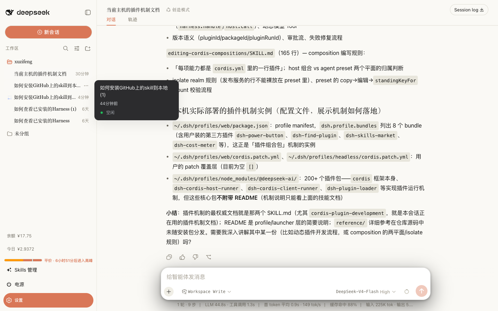
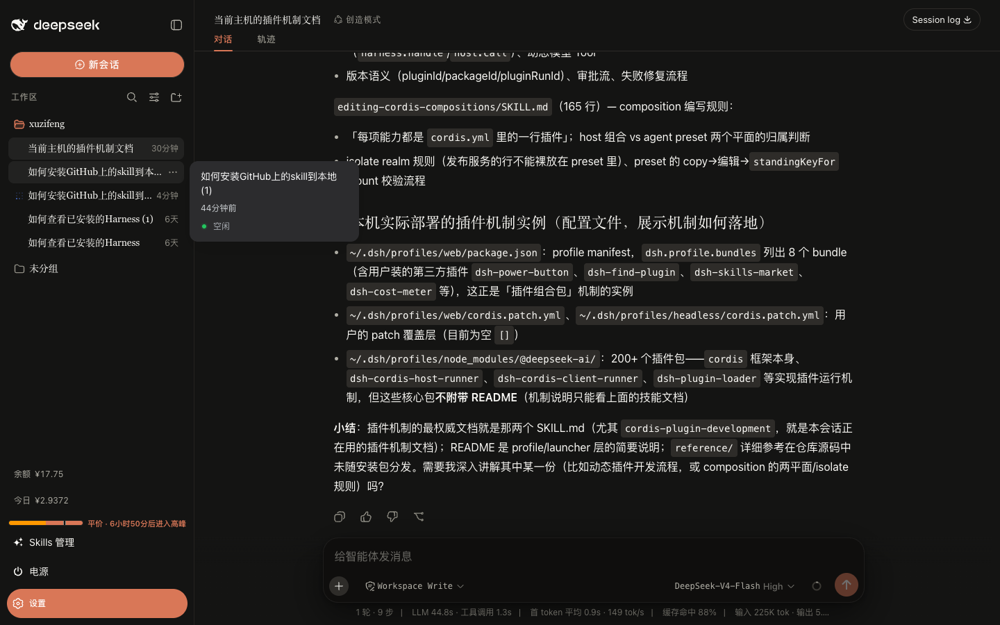

<div align="center">
# DSH Claude Style

**A Claude Code Desktop theme for the DeepSeek Harness (DSH) web client — the warm ivory editorial canvas, the clay ember accent, and the Claude Code interaction model rebuilt on DSH.**

> **Coffee and Claude time?**

[](README.en.md) [](README.md)

[](https://github.com/Nwflower/dsh-claude-style)
[](LICENSE)

</div>

## Preview

<table>
  <tr>
    <td align="center" width="50%"></td>
    <td align="center" width="50%"></td>
  </tr>
</table>

> Light: ivory canvas `#FCFCFB` with a muted sidebar `#FBFBF9`. Dark: warm black `#141413`. The theme follows the system color scheme; clay ember `#D97757` is the single accent on both canvases.

## Fonts

> **Important: the JetBrains Mono code font ships with the plugin and is served to the browser as a webfont by the plugin host — no installation needed. The Anthropic Sans/Serif fonts are NOT shipped with the npm package**; they remain in the repository [`fonts/`](fonts/) for download. You can either install them on the system, or skip installation entirely: drop the two `.ttf` files into the plugin package's `fonts/` directory and the host serves them as webfonts the same way (identical files, identical result). Either way, refresh / restart web afterwards.

| Font | Used for | File |
|---|---|---|
| Anthropic Sans Web Text | UI chrome | [`fonts/AnthropicSansWebText.ttf`](https://github.com/Nwflower/dsh-claude-style/raw/main/fonts/AnthropicSansWebText.ttf) |
| Anthropic Serif Web Text | Conversation body / markdown | [`fonts/AnthropicSerifWebText.ttf`](https://github.com/Nwflower/dsh-claude-style/raw/main/fonts/AnthropicSerifWebText.ttf) |
| JetBrains Mono Variable | Code / code blocks | [`fonts/JetBrainsMonoVariable.ttf`](https://github.com/Nwflower/dsh-claude-style/raw/main/fonts/JetBrainsMonoVariable.ttf), [`fonts/JetBrainsMonoItalicVariable.ttf`](https://github.com/Nwflower/dsh-claude-style/raw/main/fonts/JetBrainsMonoItalicVariable.ttf) |

Enabling the Anthropic faces (pick one): ① install on the system — double-click the `.ttf` on Windows → *Install*, or import via *Font Book* on macOS; ② no-install — copy the `.ttf` files into the plugin package's `fonts/` directory (next to `JetBrainsMonoVariable.ttf`). Refresh the page afterwards.

> JetBrains Mono is distributed under the [SIL Open Font License](fonts/OFL.txt). The Anthropic Sans/Serif typefaces are Anthropic's property, provided for personal use only and not covered by the MIT license above. See [LICENSE](LICENSE) for the font notice.

## Install

> Tested on dsh 0.1.5-rc.2

1. Install via terminal

```bash
dsh plugin --profile web add dsh-claude-style                  # npm package (recommended)
dsh plugin --profile web add Nwflower/dsh-claude-style         # GitHub source
```

2. Install via [Plugin Marketplace](https://github.com/dsh-market/dsh-market)

Only one theme should be active at a time. After installing, **restart `dsh web`** and refresh the page.

## Usage

1. **Theme** — applies the whole canvas automatically after install; no configuration needed. Light and dark follow the system color scheme.
2. **Permission segments** — the composer gets a Read | Edit | Auto segmented control replacing the shipped access-mode menu: read-only, workspace write, and full access (Auto is switched through the shipped risk-confirmation dialog).
3. **Model picker** — the composer's model seat becomes a two-level Claude-style menu: the first level lists DeepSeek's official models, a divider, the reasoning-effort row and "More models", and the second opens beside it. Every model row carries the mark of the **vendor that made the model** (not the provider reselling it), and the "More models" group headers carry the provider's mark. The marks are [Lobe Icons](https://lobehub.com/icons) mono glyphs painted in the theme's own text colour, so they stay legible on both canvases — no React dependency, and no full-colour logos.
4. **Brand switch** — Settings (`Ctrl+,`) → **Claude Style**: the sidebar brand flips between the Claude starburst + the official Claude wordmark and Anthropic (`A\` + ANTHROPIC wordmark); the hero mark follows the choice with the clay fill. The choice persists in the browser; `claude` is the default.
5. **Account drawer** — the sidebar footer button opens a hover popover with quick access to Settings (`Ctrl+,`) and plugin management; the username row at its top is an easter egg: it opens Claude's own "Your account is on hold" page (a purely local reproduction that touches no real state — click any control on it, or press `Esc`, to leave; it deliberately stays put when the window loses focus, so you can switch away and read it). That page's language is its own setting (**Account-hold easter egg language**, Chinese/English, English by default).
6. **Status polish** — thinking turns pick one of Claude Code's 185 spinner verbs per turn; the workspace loading state uses a Fluent-style circular indicator.

## Disable & Uninstall

Pause the theme without uninstalling — add the following to the profile's `cordis.patch.yml` (`~/.dsh/profiles/web/cordis.patch.yml`):

```yaml
- id: ui-skin-claude-style
  disabled: true
```

It hot-reloads within about a second; refresh to return to the stock look.

```bash
dsh plugin --profile web remove dsh-claude-style   # uninstall
```

Then restart `dsh web`; remove hand-added rows for this theme from `cordis.patch.yml` as well.

## Docs

| Document | Description |
| --- | --- |
| [Design Tokens](docs/STYLE.md) | Palette, typography, shapes, plus the bundle source layout and host-selector discipline |
| [Changelog](CHANGELOG.md) | Version history |
| [Contributing](CONTRIBUTING.md) | How to build from `src/`, commit rules, and the screenshot/regression tooling |
| [AGENTS.md](AGENTS.md) | Development guide for AI assistants: build commands, fragment rules, host-selector discipline, and the release flow (Chinese) |

## Related Links

> Running several themes side by side? Recommended: [dsh-skin-manager](https://github.com/xiaoyangcheng84-svg/dsh-skin-manager) — switch all installed themes from its Settings page.

## Star History

[](https://www.star-history.com/?type=date&repos=Nwflower%2Fdsh-claude-style)
